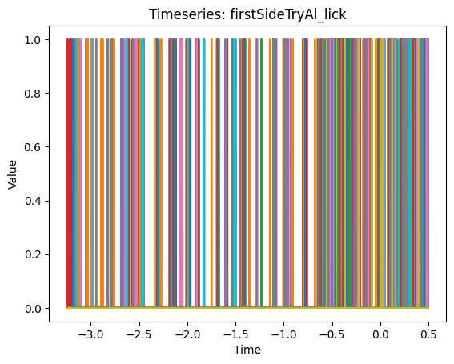
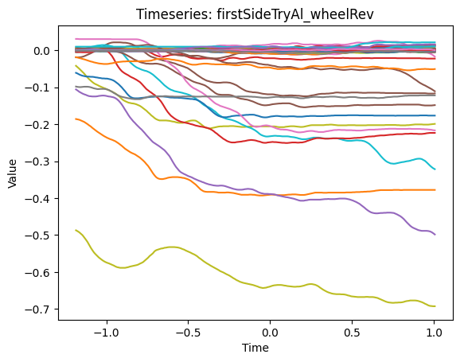

<!DOCTYPE html>
<html lang="en">
<head>
    <meta charset="UTF-8">
    <meta name="viewport" content="width=device-width, initial-scale=1.0">
    <title>Dandiset Summary</title>
    
</head>
<body>

<h1>Dandiset 000016 Summary</h1>

<h4>File Name</h4>

sub-mouse1-fni16_ses-170808190057.nwb

<h2>Plots</h2>

<h2>Images</h2>

No Images Were Found !

</body>
</html>

